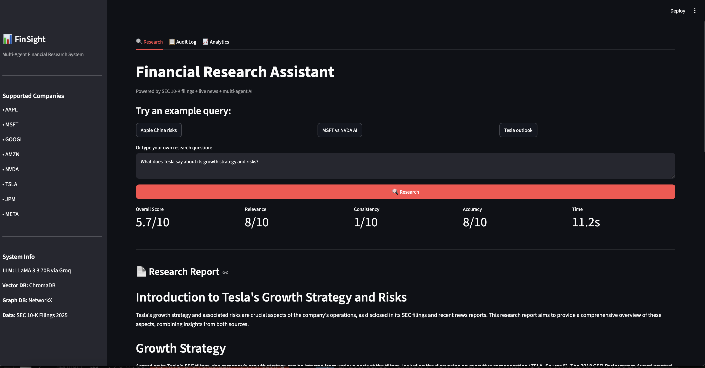
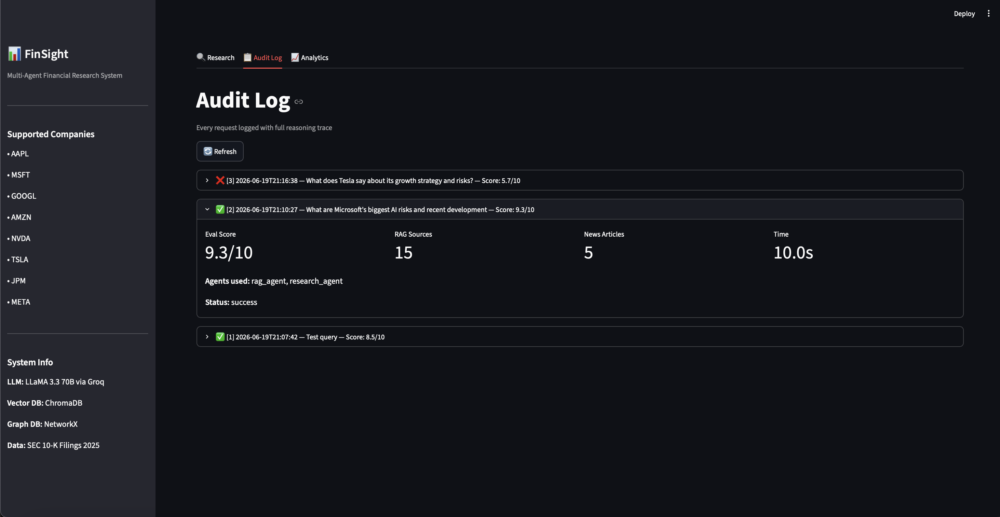
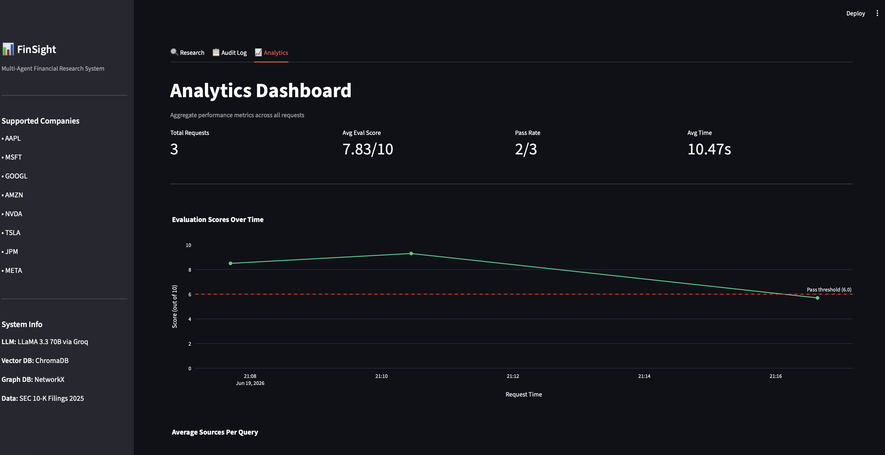

# 📊 FinSight - Multi-Agent Financial Research System

FinSight is an AI-powered financial intelligence platform that analyzes public companies using SEC filings, knowledge graphs, vector search, and multi-agent reasoning.

Users can ask natural language questions about a company and receive a structured, source-backed analyst report generated from SEC filings and recent public information.

---

## Example Questions

- What are Apple's biggest risks related to China?
- Compare Microsoft and Nvidia's AI strategies.
- What growth challenges does Tesla mention in its latest filing?
- Which companies appear most exposed to supply chain disruptions?

---

## Key Features

- Hybrid RAG system using ChromaDB and Knowledge Graph search
- Multi-agent workflow for planning, research, retrieval, and synthesis
- SEC 10-K filing ingestion and analysis
- Source-cited financial research reports
- Prompt injection detection and input validation
- Audit logging and response evaluation
- FastAPI backend and Streamlit dashboard

---

## Architecture

```text
User Query
    │
    ▼
Planning Agent
    │
 ┌──┴───────────┐
 ▼              ▼
RAG Agent   Research Agent
 │              │
 ▼              ▼
ChromaDB    Web Search
Knowledge Graph
 └─────┬───────┘
       ▼
Synthesis Agent
       ▼
Evaluation & Audit
       ▼
Final Report
```

## Tech Stack

| Component | Technology |
|------------|------------|
| LLM | Llama 3.3 70B via Groq |
| Embeddings | Sentence Transformers |
| Vector Database | ChromaDB |
| Knowledge Graph | NetworkX |
| Backend | FastAPI |
| Frontend | Streamlit |
| NLP | spaCy |
| Storage | SQLite |
| Data Source | SEC EDGAR Filings |

---

## Workflow

1. Ingest SEC 10-K filings.
2. Parse, clean, and chunk documents.
3. Generate embeddings and build a knowledge graph.
4. Retrieve relevant filing sections and supporting information.
5. Generate a cited analyst report using a multi-agent pipeline.
6. Evaluate and log results for transparency.

---

## Screenshots

### Research Dashboard



### Audit Log Dashboard



### Analytics Dashboard



---

## Skills Demonstrated

- Retrieval-Augmented Generation (RAG)
- Multi-Agent Systems
- Knowledge Graphs
- Vector Databases
- FastAPI Development
- LLM Integration
- NLP & Information Extraction
- AI Evaluation Pipelines
- Observability & Audit Logging
- Financial Data Processing

---

## Future Improvements

- Earnings call transcript analysis
- Portfolio-level risk dashboards
- Additional company coverage
- Cloud deployment and monitoring

---

Built with Python, FastAPI, Streamlit, ChromaDB, NetworkX, and Llama 3.3 70B.
